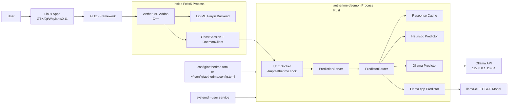

# AetherIME System Architecture + AI Diagram Prompts

This document is the single-source architecture reference for the current Linux implementation.

---

## 1) Goal and Scope

AetherIME is a Linux input method composed of:

- **Fcitx5 addon**: real-time IME behavior (preedit, candidates, selection, commit).
- **Pinyin engine**: full pinyin candidates via LibIME (`sc.dict` + `zh_CN.lm`), with fallback lexicon.
- **Ghost completion engine**: predicts post-commit continuation text; accepted by `Tab`.
- **AI daemon**: local service routing prediction requests to local model backends (`heuristic`, `ollama`, `llama.cpp`).

The system is local-first by design and can run fully offline when using heuristic or local GGUF backends.

---

## 2) Runtime Topology (Container / Process View)



---

## 3) Component Responsibilities

### 3.1 Fcitx5 Addon (`fcitx5/`)

- `AetherImeEngine` (`InputMethodEngineV2`) handles engine lifecycle and per-context state creation.
- `AetherImeState` manages key events, composing buffer, candidate list, ghost text, AI on/off state.
- `updateUI()` renders:
  - preedit (`buffer`)
  - candidate panel (when composing)
  - ghost text (italic style, when available)
  - status line (`AI:on/off`, source, `PY:libime/fallback`)
- `buildPredictContext()` reads surrounding text from current app context and builds:
  - `prefix`: up to 256 chars before cursor + commit tail
  - `suffix`: up to 128 chars after cursor

### 3.2 Pinyin Path (`LibImeBackend`)

- Loads dictionary + language model:
  - `/usr/share/libime/sc.dict` (or override env)
  - `zh_CN.lm` under distro lib path (or override env)
- On composing (`buffer` non-empty), returns pinyin candidates from LibIME.
- If LibIME unavailable, falls back to built-in tiny lexicon.

### 3.3 Ghost Completion Path (`GhostSession` + `DaemonClient`)

- Only requests ghost prediction when composing buffer is empty (post-commit / non-composing stage).
- Uses mode `FIM` by default, with full context (`prefix + suffix`) from surrounding text.
- Talks to daemon over newline-delimited JSON on Unix socket.

### 3.4 AI Daemon (`daemon/`)

- `PredictionServer`: accepts socket connections and processes each line as one JSON request.
- `PredictorRouter`:
  - normalizes request,
  - applies effective mode (`fim` -> `next` fallback when suffix empty),
  - serves cache hits,
  - executes primary backend with timeout,
  - falls back to heuristic on backend failure.
- Backends:
  - `heuristic`: deterministic fallback;
  - `ollama`: HTTP `/api/chat`;
  - `llamacpp`: local `llama-cli` process.

### 3.5 Service and Config

- Config load order:
  1. `AETHERIME_CONFIG` env path,
  2. `~/.config/aetherime/config.toml`,
  3. daemon defaults.
- Recommended production mode: `systemd --user` keeps daemon auto-start and auto-restart.

---

## 4) Critical Data Paths

### 4.1 Pinyin Candidate Flow (during composing)

1. User types `chi` etc.
2. Addon updates composing buffer.
3. Addon queries LibIME for candidates.
4. Candidate list is shown (`1..0`, arrows, paging).
5. `Space`/number/`Enter` commits selected text.

### 4.2 Ghost Completion Flow (after commit / non-composing)

1. User commits text.
2. Addon rebuilds context from app surrounding text.
3. Addon sends `predict` request (`prefix`, `suffix`, `mode=fim`).
4. Daemon routes to model backend and returns `ghost_text`.
5. Addon renders ghost text (lightweight visual style).
6. User presses `Tab` to accept and commit ghost text.

---

## 5) IPC Contract (summary)

Transport: Unix Domain Socket + newline-delimited JSON.

Request example:

```json
{"id":"r1","type":"predict","prefix":"我们","suffix":"继续讨论","language":"zh","mode":"fim","max_tokens":8,"latency_budget_ms":5000}
```

Response example:

```json
{"id":"r1","type":"predict","ghost_text":"先","candidates":["先"],"confidence":0.71,"source":"local_fim","elapsed_ms":120}
```

Error responses:

- `invalid_request`
- `timeout`
- `internal`

---

## 6) Reliability, Performance, Privacy

- **Timeout guard**: request-level timeout protection in daemon.
- **Cache**: memory cache keyed by `(prefix, suffix, language, mode, max_tokens)`.
- **Fallback strategy**: primary backend failure -> heuristic backend.
- **Local-first privacy**: default backend can be fully local; cloud endpoint is optional and currently disabled by default config.

---

## 7) Files You Should Look At

- Addon core: `fcitx5/src/aetherime_addon.cpp`
- Socket client: `fcitx5/src/daemon_client.cpp`
- Pinyin backend: `fcitx5/src/libime_backend.cpp`
- Daemon entry: `daemon/src/main.rs`
- Daemon server: `daemon/src/server.rs`
- Router/backends: `daemon/src/predictor/`
- Default config: `config/aetherime.toml`
- User service installer: `scripts/install-user-daemon-service.sh`

---

## 8) AI Drawing Prompts (copy directly)

### Prompt A (Best for full architecture diagram)

```text
Draw a modern C4-style system architecture diagram for a Linux AI input method named AetherIME.

Requirements:
1) Show clear boundaries:
   - User Application Layer (GTK/Qt apps)
   - Fcitx5 Process
   - AetherIME Daemon Process
   - Local AI Runtime
2) Components in Fcitx5 process:
   - AetherIME Addon (AetherImeEngine + AetherImeState)
   - LibIME Pinyin Backend (sc.dict + zh_CN.lm)
   - GhostSession + DaemonClient
3) Components in daemon:
   - PredictionServer (Unix socket listener)
   - PredictorRouter (mode handling + cache + fallback)
   - Backends: Heuristic, Ollama, Llama.cpp
4) Connections:
   - User typing -> App input box -> Fcitx5 -> Addon
   - Addon -> LibIME for pinyin candidates
   - Addon -> daemon via Unix socket /tmp/aetherime.sock
   - Ollama backend -> http://127.0.0.1:11434/api/chat
   - Llama.cpp backend -> llama-cli + GGUF model
5) Annotate key behaviors:
   - During composing: show candidate list selection (1..0 / Space)
   - After commit: show ghost text prediction from full surrounding context (prefix + suffix, FIM)
   - Tab accepts ghost text
6) Non-functional labels:
   - timeout guard
   - response cache
   - fallback to heuristic on failure
   - local-first privacy
7) Visual style:
   - clean, technical, dark theme, high contrast
   - directional arrows with labels
   - no unnecessary cloud icons unless explicitly labeled optional
```

### Prompt B (Sequence diagram for runtime behavior)

```text
Create a sequence diagram for AetherIME runtime:

Participants: User, AppInputBox, Fcitx5, AetherIMEAddon, LibIME, DaemonClient, PredictionServer, PredictorRouter, Ollama/LlamaCpp, HeuristicFallback.

Flow 1 (pinyin composing):
- User types pinyin (e.g., "chi")
- Addon updates buffer
- Addon queries LibIME candidates
- Fcitx5 shows candidate list
- User selects candidate -> commit text

Flow 2 (ghost completion, post-commit):
- Addon reads surrounding text around cursor
- Builds prefix + suffix (FIM context)
- Sends predict request over /tmp/aetherime.sock
- Router checks cache, calls primary backend
- On failure fallback to heuristic
- Returns ghost_text
- Addon displays ghost text
- User presses Tab -> commit ghost text

Include timeout and error branches.
```

### Prompt C (Chinese version, for Chinese-capable image models)

```text
请绘制 AetherIME（Linux AI 输入法）的完整系统架构图，要求工程化、可落地。

必须包含：
1）分层边界：应用层（GTK/Qt 输入框）、Fcitx5 进程、AetherIME Daemon 进程、本地模型运行时。
2）Fcitx5 侧模块：AetherIME Addon、LibIME 拼音词库（sc.dict + zh_CN.lm）、GhostSession + DaemonClient。
3）Daemon 侧模块：PredictionServer（Unix Socket）、PredictorRouter（模式选择、缓存、超时、回退）、Heuristic/Ollama/Llama.cpp 后端。
4）关键链路：
   - 打字 -> 候选词（LibIME）
   - 提交后 -> 基于上下文前后文（prefix + suffix）的 FIM 预测
   - Tab 接受幽灵词
5）协议与部署信息：
   - /tmp/aetherime.sock
   - Ollama API: http://127.0.0.1:11434/api/chat
   - systemd --user 托管 daemon
6）图上标注非功能特性：本地优先、超时保护、缓存命中、失败回退 heuristic。

风格：现代、简洁、深色科技风、箭头与标签清晰、尽量使用工程架构图规范（类似 C4）。
```

---

## 9) Notes for Future Diagram Updates

When architecture changes, update this file first, then regenerate diagrams from Prompt A/B/C.
